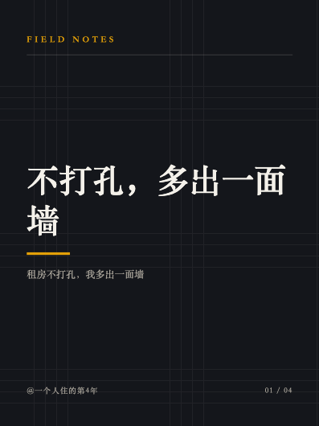
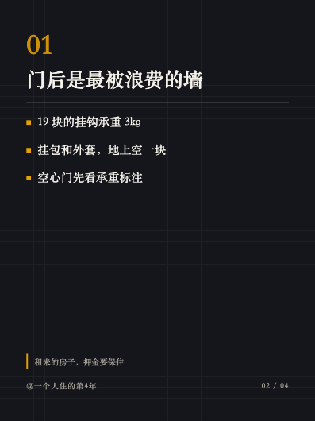
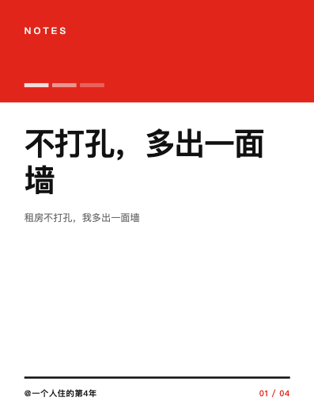
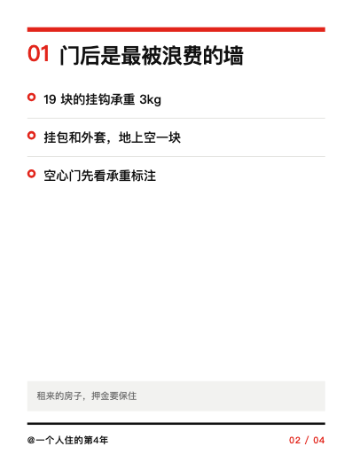
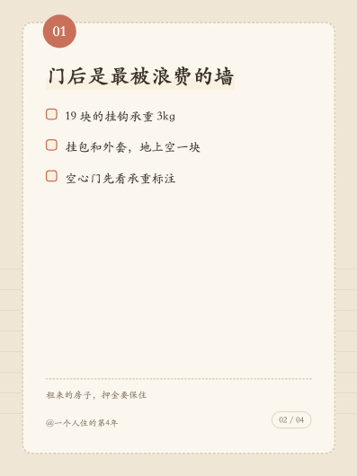

# generation/ — 内容生成

**P1 已落地：公众号文案链 + wenyan 渲染 + 封面。**
**P2 已落地：小红书图文笔记文案链 + 3:4 卡片渲染。**
**P3 已落地：抖音短视频口播脚本链 + MoneyPrinterTurbo sidecar 渲染 + 9:16 封面。**

## 模块

| 模块 | 作用 | 复用（License） |
|---|---|---|
| `llm.py` | `SupportsLLM` 协议 + Anthropic 实现：模型/effort/预算记账/拒答/异常分类；`build_llm()` 按 `SW_LLM_BACKEND` 选后端 | `anthropic`(MIT) |
| `llm_dsh.py` | 同一协议的 deepseek-harness 实现：runtime 子进程池、JSON 提取、usage 提取、**受限组合零工具**审计（P5） | `deepseek-harness-sdk`(MIT)，**可选依赖** |
| `textutil.py` | 两条链共用的纯文本工具（剥围栏、截断、去零宽、累加用量） | — |
| `wechat_article.py` | 公众号去 AI 味 SOP 五步链 | prompt 自研 |
| `wechat_render.py` | Markdown → 内联样式 HTML | `@wenyan-md/cli`(Apache-2.0)，Node 子进程 |
| `cover.py` | HTML 模板 → Playwright 截图 PNG；`screenshot_batch` 是两处渲染的共用底座 | `playwright`(Apache-2.0)，**可选依赖** |
| `xhs_note.py` | 小红书文案链（角度 → 卡片/文案 → 初检 → 至多一次整包修订 → 终检） | prompt 自研 |
| `xhs_cards.py` | 卡片脚本 → 1242×1656 PNG，三套主题 | `playwright`(Apache-2.0) |
| `video_script.py` | 抖音口播脚本链（角度 → 脚本 → 自评 → 去 AI 味）+ 口语清洗 | prompt 自研 |
| `mpt_client.py` | MoneyPrinterTurbo REST 客户端（建任务 / 轮询 / 下载） | `MoneyPrinterTurbo`(MIT)，**独立容器** |
| `video_pipeline.py` | `generate_douyin_bundle()`：脚本 → 渲染 → 成片 + 封面 → `ContentBundle` | — |
| `pipeline.py` | `generate_wechat_bundle()` / `generate_xhs_bundle()` → `ContentBundle` | — |
| `templates/wechat_cover.html` | 封面模板（公众号 900×383 / 900×900，抖音 1080×1920） | 自研 |
| `templates/xhs/<theme>/{cover,page}.html` | 小红书卡片模板（3:4） | 自研，设计思路参考 `qiaomu-info-card-designer`(MIT) |

## Claude API 调用约定（勿凭记忆改）

`generation/llm.py` 是唯一出口，约定与 SDK 0.122 对齐：

- 默认模型 `claude-opus-5`，`LLM_MODEL` 环境变量可覆盖。
- **不传** `temperature` / `top_p` / `top_k`（Opus 5 会 400），**不传** `budget_tokens`，
  **不做** assistant prefill（同样 400）。
- `thinking` 省略即 adaptive；深度用 `output_config={"effort": ...}` 控制，默认 `medium`。
- 默认走 `client.beta.messages.create(betas=["server-side-fallback-2026-07-01"],
  fallbacks="default")`——拒答时服务端按类别自动回落，比自己维护备用模型列表稳。
- **长输出必须流式**：`client.beta.messages.stream()` + `get_final_message()`，
  否则大 `max_tokens` 会撞 HTTP 超时。
- 结构化输出走 `client.messages.parse(output_format=PydanticModel)` → `parsed_output`。
  该路径在非 beta 命名空间，**没有** server-side fallback。
- **先查 `stop_reason == "refusal"` 再读 `content`**——拒答是 HTTP 200，
  `content` 可能是空数组，直接 `content[0]` 会炸。

异常翻译（按 SDK 继承链，顺序不能反）：
`RateLimitError → LLMRateLimited`、`APIStatusError → LLMAPIError`、
`APIConnectionError → LLMConnectionError`。

## deepseek-harness 后端（P5，可选）

`SW_LLM_BACKEND=dsh` 时 `build_llm()` 返回 `generation/llm_dsh.py::DshLLM`。
**四个消费方一行都不用改**——它们只认 `SupportsLLM`。

后端特有的三件事（详见模块 docstring 与 `docs/ARCHITECTURE.md` 第 10 节）：

- **结构化输出没有原生通道**：prompt 尾部注入 JSON Schema，回复里取**最后一个**
  顶层 JSON 对象做 Pydantic 校验，失败重试一次——**格式错**回喂错误信息（预算不变），
  **被截断**则抬一档预算重发原 prompt（回喂"JSON 不完整"没有意义：模型不是不会写，
  是没地方写）。
- **`system` 拼进用户消息**：SDK 线协议没有 per-call system 字段（persona 是进程级的）。
- **`model` / `effort` / `max_tokens` 是进程级**：按 `(model, effort, max_tokens)` 分桶起
  runtime 子进程，池子按 LRU 封顶（`SW_DSH_MAX_LIVE_RUNTIMES`，默认 4）。预算维度收敛
  到三档（见下）；关闭模型路由时保持旧的单模型分桶语义，开启分档路由后完整键的
  组合数可能超过默认池上限，超出的进程由 LRU 回收。

异常映射按 dsh 的**结构化 error code**路由（绝不 parse message）：
`MISSING_CREDENTIAL / INVALID_CREDENTIAL / AUTH / NO_ADAPTER / UNKNOWN_MODEL → LLMUnavailable`、
`RATE_LIMIT → LLMRateLimited`、`TIMEOUT / TRANSPORT → LLMConnectionError`、
其余 → `LLMAPIError`；`turn/end.kind == "blocked" → GenerationRefused`、
`"max-tokens"` 且**有文本**时与 Anthropic 同语义（返回截断文本，不抛）；
`"max-tokens"` 且**零文本**时抬一档预算自愈重试一次，两次都截断才抛 `LLMAPIError`
（文案带上两次的预算），两次的 usage 都计进账本与返回值。

**红线：模型零工具。** 组合在 `configs/dsh/cordis.yml`，静态审计
（`audit_composition`）+ 真 runtime 的 `request/header.tools` 两道验证，
命令见 `docs/OPS.md` 第 7.5.3 节。

### 前缀缓存（`prompt_cache_key`）

上游网关**不做**隐式前缀缓存：请求体里没有 `prompt_cache_key` 就一次也不会命中
（实测：同一段 3115 token 前缀连发两次，`cached_tokens` 都是 0）。这条链上要让它上线，
两个条件缺一不可：

1. **开关**在 `configs/dsh/cordis.yml` 的 provider 段：`cacheRetention: long`。
   pi-ai 的 `openai-completions` 只在 `baseURL` 含 `api.openai.com`、或本字段是 `long`
   时才把 `prompt_cache_key` 放进请求体；本项目走私有网关，URL 那条对不上。
   `scripts/preflight.py` 的「dsh 后端 前缀缓存」一项静态守住它。
2. **取值**由 runtime 写死成"session id 的前 64 个字符"（pi-ai 的
   `clampOpenAIPromptCacheKey`），没有别的注入位。所以 `generation/llm_dsh.py` 把两件事
   叠进同一个串：前 64 字节是 `prompt_cache_key()` 算出来的**组键**，后面挂一段唯一后缀，
   于是 runtime 侧每次仍然是一个新会话（不串历史），发到上游的键却是稳定的。

组键按「**哪些调用共享同一段字面前缀**」取，即 `(model, stable_prefix(system))`：
`compose_prompt()` 把 system 折在用户消息最前面，所以同一个 system 段的多次调用请求开头
逐字节相同。**刻意不按 purpose 切**——同一条流水线里多个 purpose 共享同一个 system 段，
再切一刀只会把它们拆成互不复用的单例，命中率退回 0。缓存键也**不进** `RuntimeKey`：
它是逐调用参数，并进去只会把同一个子进程按前缀劈成好几份。

命中率直接查账本：`CostLedger.meta` 里每行都有 `cache_key` 与
`cache_read_input_tokens`，按 `cache_key` 聚合即可（缓存读不进计费口径，见下）。

**实测口径（`<私有网关域名>`，2026-08-24 复核）**：机制本身通了——同一段前缀第二次
调用真的能命中。但**门槛是按路由分的**，两条路由差一个数量级，别混着讲：

| 路由 | 稳定前缀 → 第二次 `cache_read` | 门槛 |
|---|---|---|
| `gpt-5.6-luna`（`SW_DSH_MODEL_ROUTING=true`） | 762 / 1080 / 1241 / 1561 tok 各连打三次全 0；1921→1792、2281→1792、2962→2816 | **落在 1561 与 1921 token 之间** |
| `deepseek-v4-flash`（路由**默认关**时的模型） | 328 tok → 第二次 `cache_read=256` | ~300 token 就缓存 |

命中要求**逐字节相同的前缀足够长**，长度才是上游肯不肯缓存的闸；分组键改变不了长度。
本仓每个调用点的稳定前缀只有 system 段那 ~500 token（每份任务模板的第一个占位符都
落在开头 ~70 token 以内，见 `prompts/*/`）：

- 走 **deepseek 路由**（`sw_dsh_model_routing` 默认 `False`，见 `core/config.py`）时，
  这个长度**已经在门槛之上**，常规链路当场就吃到缓存，不用改任何提示词。
- 走 **gpt-5.6 路由**时够不着，常规链路仍然命中 0；真正吃到缓存的是"原样重发同一条
  prompt"的那两条路——截断自愈加码重试、结构化输出重试。要让常规链路也吃上，得把
  模板改成"静态规则在前、插值内容在后"、把稳定前缀顶过 ~1.9k token，那是提示词结构
  的决定，不在这条改动的范围里。

这台多渠道网关早期扫描时表现出抽签式命中（四次里中两次）；2026-08-24 复核的每档三次
都稳定，但别把"稳定"当承诺——命中率以账本聚合为准，不要写死在期望里。

## 输出预算（`generation/output_budget.py`）

默认模型是 **reasoning 模型**：`max_tokens` 是"思考 + 正文"的**共用**上限，
不是"正文最多多长"。按正文长度估出来的数字必然偏小——2026-08-17 事故里
`xhs.angle` 平时只写 853 token，却有一次把 4096 全烧在思考上、正文零字。

所以每个调用点都**显式**传 `max_tokens`，取值只许落在三档上（多一个取值 = dsh 多一个
常驻子进程）。自愈加码也走这张梯子，不会造出第四个桶：

| 档位 | 取值 | 谁在用 |
|---|---|---|
| 标准档 | 8192 | 切角度 / 写正文 / 自评 / 改写 / 配 meta / 语义审核 / 复盘（也是 `LLM_MAX_TOKENS` 兜底值） |
| 大输出档 | 16000 | `sourcing.select`（实测 9047）、`xhs.cards`（实测顶满 4096 被截断）、`douyin.script`、公众号长文正文（也是 `LLM_ARTICLE_MAX_TOKENS`） |
| 天花板档 | 32000 | **没有调用点显式声明**，只由截断自愈从大输出档加码上来 |

改预算改 `CALL_SITE_BUDGETS` 一处即可，不要在生成链里散落魔法数字。
`CostLedger.meta` 里记了每次调用的 `stop_reason` 与 `max_tokens`，
`uv run python scripts/preflight.py` 的"输出预算"一项会把今天顶到上限的调用点报出来。

## 去 AI 味 SOP

```
大纲 → 正文 → 风格润色 → 质量自评(结构化) → [条件] 去 AI 味改写 → 标题/摘要/封面词(结构化)
```

五步各是一次独立调用，不是一个大 prompt。每步只处理一件事，比单轮长 prompt 稳定，
中间产物全部留在 `ArticleDraft.trace` 里可审计。

第五步**有条件触发**：自评 `verdict != "pass"`、`overall < 8`、`ai_flavor < 8` 或
有 `blocking_issues` 才改写。自评已经很好就不动——越改越平是真实风险。

prompt 在 `prompts/wechat/*.md`，账号人设在 `prompts/accounts/<account_id>/persona.md`
（`Account.extra["persona"]` 优先级更高，便于在 UI 上临时改）。

## 小红书图文（P2）

```
切角度 → 卡片脚本(结构化) → 标题/正文/标签(结构化) → 初检(结构化)
                                                        ↓ 不通过或强制优化
              终检(结构化) ← 整包修订(标题/正文/卡片/标签/配图 prompt)
                    ↓ pass 且无 blocking issue
              xhs_cards.render_cards() → 1242×1656 PNG × (1 封面 + 3–8 内页)
```

和公众号链同一套骨架，差别在于**小红书是图先于文的平台**：先定卡片脚本，
正文是在"图上已经说了什么"的前提下补充，而不是先写长文再摘要成图。
prompt 在 `prompts/xhs/*.md`。初检通过时只调用一次 selfcheck；初检失败最多做一次整包修订，
终检仍不是 `pass` 或仍有 `blocking_issues` 就抛出 `XhsQualityError`，不会进入渲染、生图或入库。
`force_rewrite=True` 会让初检通过的内容也整包修订；`False`/`None` 不能绕过失败闸门。

### 平台硬限制（在 `review/inspect.py` 定义，生成侧 import 过来做兜底截断）

| 项 | 限制 | 违反时 |
|---|---|---|
| 标题 | ≤ 20 字 | `inspect.title.too_long` block |
| 正文（**含话题标签**） | ≤ 1000 字 | `inspect.xhs.body.too_long` block |
| 图片 | 1–18 张 | `xhs.image.missing` / `xhs.image.too_many` block |
| 单图 | 长边 ≤ 4096px、≤ 20MB | `xhs.image.oversize` block |
| 图片比例 | 3:4 ~ 4:3 | `xhs.image.aspect` warn（会被平台裁） |
| 话题标签 | 建议 3–8 个，硬上限 10 | `xhs.tags.count` warn / `xhs.tags.too_many` block |

模型超字数是常态，`xhs_note.py` 一律做兜底截断并把截断记进 `draft.warnings`——
长度是平台硬限制，不能只靠 prompt 约束。话题标签算进正文字数，所以生成链会在
selfcheck 前给标签让出空间并生成唯一的 canonical publish body；`draft.body`、兼容方法
`body_with_tags()` 与 `ContentBundle.body_markdown` 始终返回同一个已经受检的字符串。

### 卡片主题

`render_cards(draft, output_dir, theme=...)`，三套：

| 主题 | 风格 | 字体栈 | 封面 | 内页 |
|---|---|---|---|---|
| `editorial` | 杂志风：深底、衬线、大留白 | 宋体系 |  |  |
| `swiss` | 网格风：白底、粗横线、单一强调色 | 黑体系 |  |  |
| `warm` | 手账风：纸张底、虚线框、胶带 | 楷体系 |  |  |

- 模板是**纯 HTML/CSS，零外链**：字体走系统字体栈，纹理/胶带/荧光笔全用 CSS 画，
  截图时不需要联网。
- 文案来自 LLM，一律 `html.escape` 后注入；字号按字数在 Python 侧自动缩放，
  CSS 再用 `-webkit-line-clamp` 兜底，长标题不会溢出。
- 每张卡片右下角有页码（`02 / 06`）、左下角有账号水印。
- 可选本地字体：把字体文件放进 `generation/templates/xhs/fonts/`（或用
  `XHS_FONT_DIR` 指目录），会以 `data:` URI **内嵌**，仍然不外链；
  总体积超 8MB 自动忽略并退回系统字体。

预览图重新生成（改了模板之后跑一次）：

```bash
uv run python - <<'PY'
from pathlib import Path
from generation.cover import ScreenshotJob, screenshot_batch
from generation.xhs_cards import (CARD_HEIGHT, CARD_WIDTH, CardOptions,
                                  available_themes, build_cover_html, build_page_html, get_theme)
from generation.xhs_note import PageSpec

page = PageSpec(headline="门后是最被浪费的墙",
                bullets=["19 块的挂钩承重 3kg", "挂包和外套，地上空一块", "空心门先看承重标注"],
                footnote="租来的房子，押金要保住")
out, jobs = Path("docs/img"), []
for name in available_themes():
    theme = get_theme(name)
    opts = CardOptions(theme=name, watermark="@一个人住的第4年", subline="租房不打孔，我多出一面墙")
    jobs += [
        ScreenshotJob(build_cover_html("不打孔，多出一面墙", theme=theme, options=opts, total=4),
                      out / f"xhs-card-{name}-cover.png", CARD_WIDTH, CARD_HEIGHT),
        ScreenshotJob(build_page_html(page, index=1, theme=theme, options=opts, total=4),
                      out / f"xhs-card-{name}-page.png", CARD_WIDTH, CARD_HEIGHT),
    ]
screenshot_batch(jobs, scale=0.32)   # scale<1 出缩略图，别把 1242×1656 原图塞进 git
PY
```

## 抖音短视频（P3）

```
切角度 → 脚本(结构化) → 质量自评(结构化) → [条件] 去 AI 味改写
                          ↓
        MPT POST /api/v1/videos（灌入 video_script / video_terms）
                          ↓  轮询 GET /api/v1/tasks/{id}
        下载成片 → data/media/<item_id>/video.mp4 + 1080×1920 封面
```

和另外两条链同一套骨架（Options / Outcome dataclass + 一个函数），
差别在于**短视频的载体是"被念出来的话"**，而且**渲染是跨进程长任务**。

prompt 在 `prompts/douyin/*.md`。

### 三件别的平台没有的事

**1. 产物必须能被念出来。** TTS 会把 `**` 读成"星星星星"、把 `#通勤` 读成"井号通勤"。
`strip_unspeakable()` 做兜底清洗（markdown 标记、项目符号、话题标签、emoji），
不只靠 prompt 约束。截断也按句切（`truncate_spoken()`）——硬截会让成片以半句话结尾。

> 踩过的坑：网上流传的 emoji 正则 `[Ⓜ-\U0001F251]` 把整个 CJK 统一表意文字区
> （U+4E00–U+9FFF）也圈进去了，会把中文正文删光。`_EMOJI` 因此**逐块列举**。

**2. 钩子必须在第一句。** 前 3 秒决定完播率，而"去 AI 味改写"最容易把钩子冲掉。
`_ensure_hook_first()` 是确定性兜底：改写后钩子不在开头就补回去，并记 warning。

**3. 素材检索词必须是英文。** Pexels / Pixabay 对中文查询基本零召回，
中文检索词会让 MPT 在 `materials` 阶段失败。`normalize_terms()` 直接丢掉非 ASCII 的词。

### 平台硬限制（同样在 `review/inspect.py` 定义）

| 项 | 限制 | 违反时 |
|---|---|---|
| 标题 | ≤ 30 字 | `inspect.title.too_long` block |
| 文案（**含话题**） | ≤ 1000 字 | `inspect.douyin.body.too_long` block |
| 口播稿 | ≤ 300 字（≈ 60 秒，5 字/秒） | 按句截断 + warning |
| 前 3 秒钩子 | ≤ 20 字 | 截断 |
| 成片 | 有且只有 1 个 | `douyin.video.missing` / `.too_many` block |
| 成片时长 | ≤ 15 分钟 | `douyin.video.too_long` block |
| 成片比例 | 9:16（±0.02） | `douyin.video.aspect` block |
| 封面 | 必须有 | `douyin.cover.missing` block |
| 话题 | 建议 2–5 个，硬上限 10 | `douyin.tags.count` warn / `.too_many` block |

成片时长与分辨率由 `review.inspect.read_video_info()` 实测：**标准库解析 MP4 box**
（`moov/mvhd` 取时长、`moov/trak/tkhd` 取分辨率，含旋转矩阵处理），装了 `ffprobe`
才作为退路。两条路都读不出时返回 `None` → warn，**不会**因为"本机没装 ffmpeg"
把内容判成不合规。

### MPT 边界

只用它的**合成能力**，**不用它内置的 LLM**：脚本由 Claude 写好后经 `video_script` /
`video_terms` 灌入（`video_script` 非空时上游跳过自己的写稿步骤）。两套 LLM 配置
会导致"改了 prompt 却没生效"这类查半天的问题，所以 sidecar 的 `config.toml` 里
`llm_provider` 一律留空。接口事实与容器编排见 `sidecars/mpt/README.md`。

### 异步任务与丢任务

MPT 的任务表在**它自己的进程内存**里，容器一重启就没了。所以：

| 环节 | 处理 |
|---|---|
| 提交后 | `task_id` 落 `render_jobs` 表（`core.models.RenderJob`，P3 新增） |
| 404 | `MptTaskLost` → 标 `lost`，**原样重提交一次**，再丢就报错 |
| `state=-1` | `RenderFailed`（永久失败），`meta.failed_stage` 留痕 |
| 管线等超时 | **不抛异常**：产出无成片的 bundle 入库，job 留 `running`，`tick_render_jobs` 继续跟，渲染完自动补挂 |
| 已批准的内容 | **不再补挂**——那会让"人看过的"和"发出去的"不是一份 |

### 成片放行闸门

含视频的内容在 `/review/{id}` 上会渲染 `<video controls>` 预览，
**勾选「已完整观看」之前批准按钮是灰的**；后端还会再校验一次 `watched` 表单字段
（缺了返回 422），`curl` 也绕不过去。这是计划 2.2 的硬约束。

## 预算

每次调用把 `usage` 计入 `core.budget.BudgetGuard`（`kind="tokens"`，计费口径 =
`input_tokens + output_tokens`，缓存命中另记不重复计费）。
超预算抛 `BudgetExhausted`，上层降级为"只出选题不出稿"。

超额时**先把剩余额度记满再抛**：token 已经真花掉了，账本必须反映耗尽，
否则下次调用还会放行。

视频渲染另计一笔 `kind="render_seconds"`（`DAILY_RENDER_SECONDS_BUDGET`，默认 3600）：

- **提交前**按估算值（成片时长 × 4，下限 60 秒）查余额，不够就**不提交**——
  MPT 一开跑就是几分钟 CPU 与素材源配额。
- **完成后**按真实墙钟耗时记账；超额时记满剩余并留 warning，**不抛异常**——
  和 token 不同，片子已经渲完落盘了，为了记账把产物扔掉是亏的。

## 依赖与降级

| 缺什么 | 行为 |
|---|---|
| `ANTHROPIC_API_KEY` | `LLMUnavailable`；两个 `/dev/*` 端点自动降级到 `ScriptedLLM` |
| Node / npx | `NodeNotAvailable`，`body_html` 留空，内容仍入库，由 `review.inspect` 报 block |
| Playwright（公众号封面） | `render_cover` 返回 `None`，列表页显示默认图，**不阻断** |
| Playwright（小红书卡片） | `render_cards` **抛** `ScreenshotUnavailable`；`generate_xhs_bundle` 接住它记 warning，产出无图 bundle 照常入库，由 `inspect` 以 `xhs.image.missing` block |
| Playwright（抖音封面） | 同公众号：`render_cover` 返回 `None`，记 warning；`inspect` 以 `douyin.cover.missing` block |
| MoneyPrinterTurbo sidecar | 连不上 / 渲染失败 / 等超时都**不抛异常**：产出无成片的 bundle 入库，由 `inspect` 以 `douyin.video.missing` block；`skip_render=true` 可挂样本片跑通链路 |
| `ffprobe` | 只是 MP4 box 解析的退路。都读不出时 `read_video_info` 返回 `None` → `douyin.video.unreadable` **warn**，不 block |

各处态度不同是有意的：公众号封面缺了只是列表页难看，小红书图文笔记缺了图**根本发不出去**，
抖音缺了成片同理——必须让它显式失败，而不是悄悄发一条没有图/没有片的内容。

## 运行

```bash
# 截图需要额外装（不在主依赖里）
uv sync --extra render && uv run playwright install chromium

# 公众号全链路（无 key 会用 ScriptedLLM）
curl -X POST "localhost:8000/dev/run_wechat_pipeline?account_id=wechat-demo-01&topic=你的选题"

# 小红书图文全链路
curl -X POST "localhost:8000/dev/run_xhs_pipeline?account_id=xhs-demo-01&topic=你的选题&theme=swiss"
# 无 chromium 时只出文案：&make_cards=false

# 抖音短视频全链路。skip_render 默认 true = 挂样本片，几秒跑完，不需要 sidecar
curl -X POST "localhost:8000/dev/run_douyin_pipeline?account_id=douyin-demo-01&topic=你的选题"
# 真渲染（要先 docker compose --profile video up -d mpt 且配好素材源 key）
curl -X POST "localhost:8000/dev/run_douyin_pipeline?account_id=douyin-demo-01&topic=你的选题&skip_render=false"
```

产出的内容进审核队列，`/review/{id}` 上能横向翻完整套卡片、或播放成片。
**批准前不会发布**——小红书 2026-03-10 公告"完全 AI 驱动的账号直接封禁"，
人工卡点是硬要求，见 `docs/POLICY.md`。含视频的内容还要**勾选「已完整观看」**才能批准。

返回体里的 `render.skip_render=true` 表示挂的是**样本片，不是真实成片**，
审核页上也会显式标出来。

## 故障排查

| 现象 | 排查 |
|---|---|
| `LLMUnavailable` | `.env` 里的 `ANTHROPIC_API_KEY` 是否填了 |
| 400 且提示 temperature/budget_tokens | 有人绕过 `llm.py` 直接调 SDK 了，改回走封装 |
| `GenerationRefused` | 看 `category`；`fallbacks="default"` 已开时说明整条链都拒了，换选题 |
| 渲染报 `NodeNotAvailable` | `brew install node`；首次 `npx -y @wenyan-md/cli` 会下载包，给足超时 |
| 封面一直是 `None` | `uv run playwright install chromium` 装浏览器 |
| `BudgetExhausted` | 看 `/stats.json` 的 `budget`；调 `DAILY_TOKEN_BUDGET` |
| 标题被截断成 32 字 | 这是有意的硬兜底，平台限制，改 `review.inspect.MAX_TITLE_CHARS` 要连带评估 |
| 小红书标题被截断成 20 字 | 同上，平台限制，见 `MAX_XHS_TITLE_CHARS` |
| `ScreenshotUnavailable` | `uv run playwright install chromium`；只想看文案就 `make_cards=false` |
| `未知卡片主题` | `theme` 只接受 `available_themes()` 里的名字；不静默回退是为了避免"以为换了风格其实没换" |
| 卡片上是方框/豆腐块 | 系统缺中文字体（常见于精简版 Linux 容器）。装思源黑体，或把字体丢进 `XHS_FONT_DIR` |
| 卡片文字溢出 | 先看 `draft.warnings` 有没有截断记录；模板侧的 `-webkit-line-clamp` 是最后兜底 |
| 抖音"缺成片" | 看 `render_jobs` 表的 `state` / `last_error`。`running` 的等 `tick_render_jobs` 补挂；`failed` 的看 `meta.failed_stage`（详见 `docs/OPS.md` 4.5.5） |
| MPT `failed_stage="materials"` | 素材源 key 没配，或 `platform_extra.search_terms` 太抽象。检索词要是**具体可拍的英文名词**（`crowded morning train`），不是概念（`efficiency`） |
| 口播稿里出现 `#` / `*` / emoji | `strip_unspeakable` 漏了新形态，补正则；不要指望 prompt 单独兜住 |
| 中文正文被清洗成空 | 检查 `_EMOJI` 正则有没有被改成大区间——那会把整个 CJK 区删光（有回归测试盯着） |
| 成片比例不对被 block | 提交时 `video_aspect` 不是 `9:16`。`VideoGenerationOptions.aspect` 默认就是竖屏，改它基本等于配错 |
| `BudgetExhausted: render_seconds` | 当日渲染额度用完。`/stats` 看用量，调 `DAILY_RENDER_SECONDS_BUDGET` 或等 UTC 0 点重置 |
